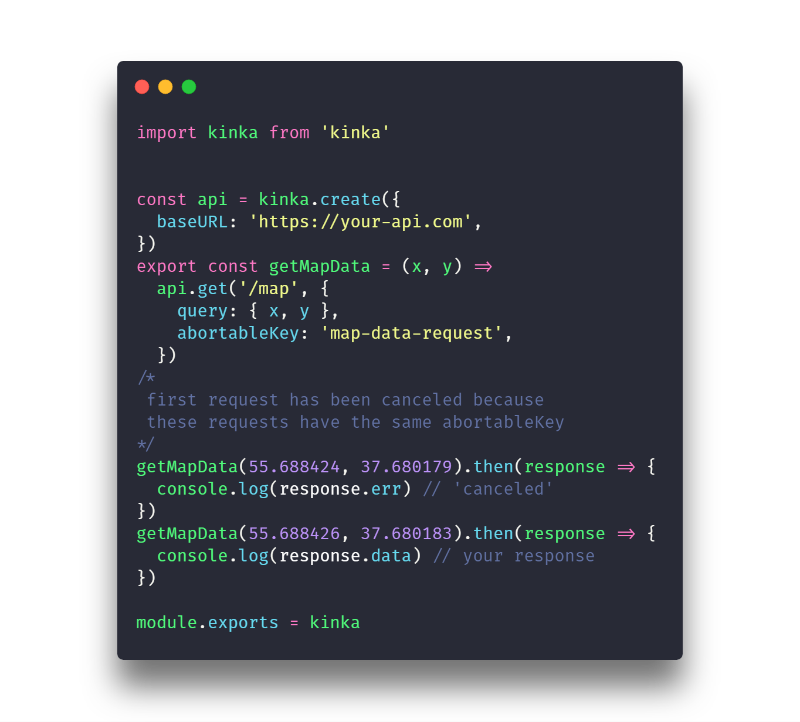
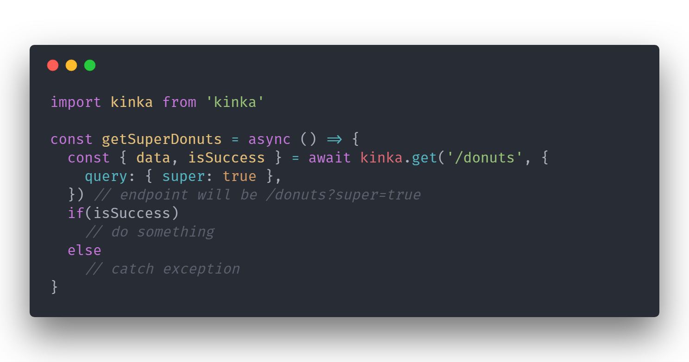

   

  
  
  
  
  
  
  

  

    ⚡️ HTTP web client for browsers ⚡️
  

**kinka** it is [most lighter 💨](https://bundlephobia.com/result?p=kinka) and very powerful JavaScript library designed for http requests!  
It will reduce your http code (which are using [XMLHttpRequests](https://developer.mozilla.org/en-US/docs/Web/API/XMLHttpRequest)) and allows do http code more simpler and easy to read.  

## 🚀 Installation

    $ npm i -S kinka
    # or using yarn
    $ yarn add kinka

## 📚 Documentation & Examples

[Documentation](./docs/documentation.md)  
[Examples](./test/examples)  
[Sandbox](https://jsfiddle.net/js2me/0y3ng8xu/)  

## Why kinka ❔

**It is the easiest way to catch your bad request**  
  
**Many [powerful features 💪](./docs/documentation.md)(e.g. auto abortable requests) which can improve your interaction with your requests**  
  
**Have [very small size](https://bundlephobia.com/result?p=kinka) which can improve site load time**  
  

## 👍 Contributing

If you want to help with the project, please refer to [guide for contribution](./CONTRIBUTING.md). It should contain most of the things you'll need to get your contribution started!  
Working on your first Pull Request? [Learn how to do it](https://egghead.io/courses/how-to-contribute-to-an-open-source-project-on-github)

## 📝 License

Licensed under the [MIT License](./LICENSE).
