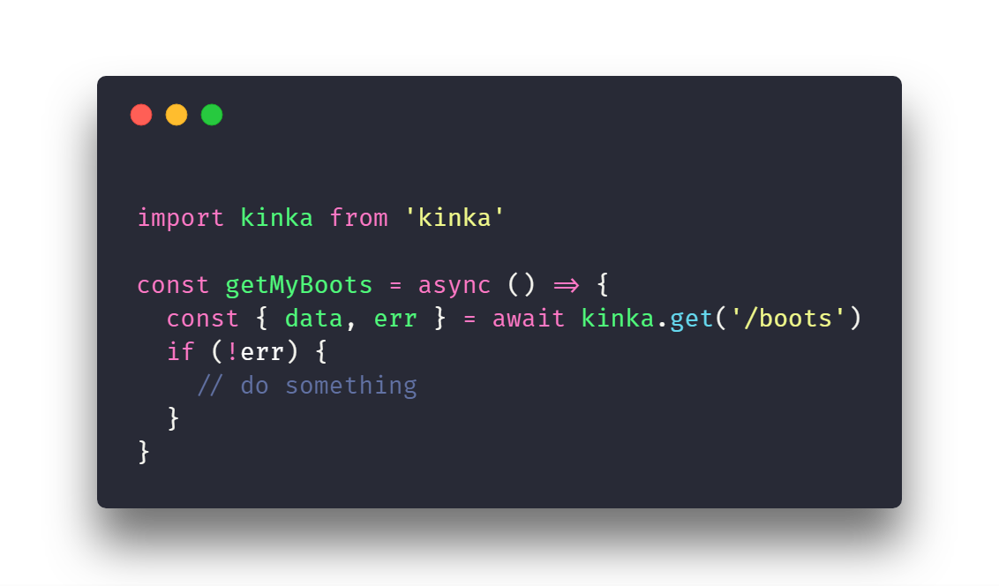
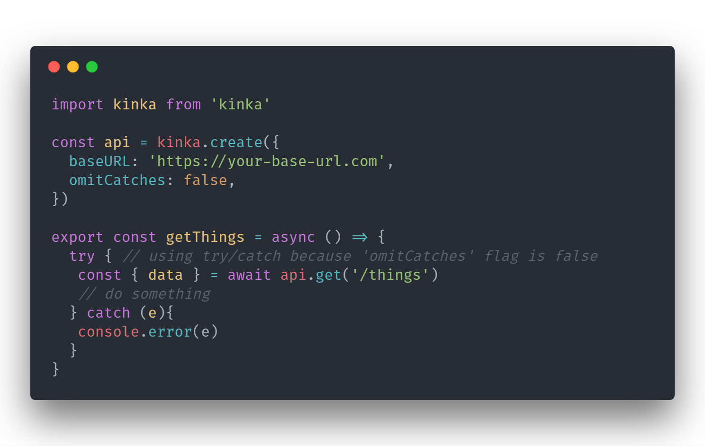

  
   
  <h1>
     
  </h1>
  

    ⚡️ HTTP web client for browsers ⚡️
  

**kinka** it is very light weight 💨 ([**~5.3KB min**, **~2KB minzip**](https://bundlephobia.com/result?p=kinka)) and more powerful JavaScript library  
It will reduce your http code (which are using [XMLHttpRequests](https://developer.mozilla.org/en-US/docs/Web/API/XMLHttpRequest)) and allows http code more simple and easy to read.

## 🚀 Installation

    $ npm i -S kinka
    # or using yarn
    $ yarn add kinka

## 📚 Documentation & Examples

[Documentation](./docs/documentation.md)  
[Examples](./examples)  
[Sandbox](https://jsfiddle.net/js2me/0y3ng8xu/)  

## Why kinka ❔

**It is easiest way to catch your bad request**
  
**More [powerful things 💪](./docs/documentation.md)(e.g. auto abortable requests) which can improve your interaction with your requests**  
  
**Have [very small size](https://bundlephobia.com/result?p=kinka) which can improve site load time**  
<!--   -->
<!--   -->

## Contributing

If you want to help kinka, please refer to [CONTRIBUTING.md](./CONTRIBUTING.md). It should contain most of the things you'll need to get your contribution started!  
Working on your first Pull Request? [Learn how to do it](https://egghead.io/courses/how-to-contribute-to-an-open-source-project-on-github)

## 📝 License

Licensed under the [MIT License](./LICENSE).
